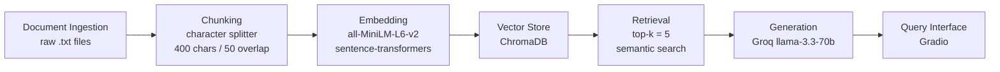

# Project 1 Planning: The Unofficial Guide

> Write this document before you write any pipeline code.
> Your spec and architecture diagram are what you'll use to direct AI tools (Claude, Copilot, etc.) to generate your implementation — the more specific they are, the more useful the generated code will be.
> Update the Retrieval Approach and Chunking Strategy sections if you change your approach during implementation.
> Update this file before starting any stretch features.

---

## Domain

UCI Data Science students face a unique recruiting landscape. It is a newer 
major with less established employer pipelines than CS, located in an Irvine 
tech corridor that is largely invisible in generic career advice. The UCI 
career center treats DS and CS recruiting as interchangeable, but students 
experience them very differently. This system makes student-generated knowledge 
about internships, professor recommendations, and what actually works for UCI 
DS students searchable and answerable.

---

## Documents

| # | Source | Description | URL or location |
|---|--------|-------------|-----------------|
| 1 | r/UCI Reddit | Students discuss why internships are hard to get at UCI | documents/reddit_uci_internship_hard.txt |
| 2 | r/UCI Reddit | General internship advice from UCI students and alumni | documents/reddit_uci_internship_advice.txt |
| 3 | r/UCI Reddit | Internship tips thread with 34 student comments | documents/reddit_uci_internship_tips.txt |
| 4 | r/UCI Reddit | Students debate whether GPA matters for CS internships | documents/reddit_uci_cs_gpa_internship.txt |
| 5 | r/UCI Reddit | Public list of open 2026/2027 internships shared by students | documents/reddit_uci_jobs_list_2026.txt |
| 6 | r/UCI Reddit | How UCI quarter system affects internship recruiting timelines | documents/reddit_uci_quarter_internship.txt |
| 7 | Rate My Professors | Student reviews of Stephan Mandt, CS 178 Machine Learning | documents/rmp_uci_mandt_cs178.txt |
| 8 | Rate My Professors | Student reviews of Michael Dillencourt, CS 161 | documents/rmp_uci_dillencourt_cs161.txt |
| 9 | Rate My Professors | Student reviews of Tianchen Qian, Stats 120B | documents/rmp_uci_qian_stats120b.txt |
| 10 | Rate My Professors | Student reviews of Thomas Yeh, ICS 46 | documents/rmp_uci_yeh_ics46.txt |

---

## Chunking Strategy

**Chunk size:** 400 characters

**Overlap:** 50 characters

**Reasoning:** Most documents are short Reddit comments and RMP reviews, 
usually 2 to 5 sentences long. A 400 character chunk captures one complete 
thought or opinion without merging multiple unrelated reviews together. 
Overlap of 50 characters helps when a key point like a professor name or 
company name falls near a chunk boundary, so retrieval can still find it 
from either side.

---

## Retrieval Approach

**Embedding model:** all-MiniLM-L6-v2 via sentence-transformers

**Top-k:** 5

**Production tradeoff reflection:** For a production system I would consider 
text-embedding-3-small from OpenAI, which has a longer context window and 
better accuracy on domain specific text. The tradeoff is cost and rate limits 
since it requires an API key. all-MiniLM-L6-v2 runs locally with no cost and 
no rate limits, which makes it practical for this project. If the user base 
included international students I would also consider a multilingual model 
like paraphrase-multilingual-MiniLM-L12-v2.

---

## Evaluation Plan

| # | Question | Expected answer |
|---|----------|-----------------|
| 1 | Which companies have actually hired UCI data science students recently? | Students mention Amazon, Blizzard, and local Irvine companies like Edwards Lifesciences as realistic targets for UCI DS students |
| 2 | Is the UCI career center worth using for data science internships? | Students give mixed reviews, some mention Career Pathways mock interviews as useful but general career center resources are seen as not DS specific |
| 3 | Does GPA matter when applying to internships as a UCI CS or DS student? | Students generally say GPA matters less than projects and experience, but some companies do have GPA cutoffs around 3.0 |
| 4 | What do students say about Stephan Mandt and CS 178 for ML preparation? | Students say Mandt is generous with grading and curves, lectures are math heavy, and the course gives a solid ML foundation useful for DS internships |
| 5 | How does UCI quarter system affect internship recruiting timelines? | Students say the quarter system makes it harder to match recruiting cycles, fall recruiting often conflicts with midterms |

---

## Anticipated Challenges

1. Reddit comments are noisy and conversational, which means chunks may 
contain slang, incomplete sentences, or off-topic tangents that hurt 
retrieval precision. A chunk that starts on-topic about internships may 
drift into unrelated complaints about campus life.

2. Key information about a specific company or professor may be spread 
across multiple short comments rather than concentrated in one place. 
If that information splits across a chunk boundary, neither chunk will 
be retrievable on its own and the system will return an incomplete answer.
---

## Architecture

---

## AI Tool Plan

<!-- For each part of the pipeline below, describe:
     - Which AI tool you plan to use (Claude, Copilot, ChatGPT, etc.)
     - What you'll give it as input (which sections of this planning.md, which requirements)
     - What you expect it to produce
     - How you'll verify the output matches your spec

     "I'll use AI to help me code" is not a plan.
     "I'll give Claude my Chunking Strategy section and ask it to implement chunk_text()
     with my specified chunk size and overlap" is a plan. -->

**Milestone 3 — Ingestion and chunking:** 
I will give Claude the Documents section and Chunking Strategy section of 
this planning.md and ask it to implement a script that loads all txt files 
from the documents/ folder, cleans them by removing blank lines and extra 
whitespace, and splits them into 400 character chunks with 50 character 
overlap. I will verify the output by printing 5 random chunks and checking 
that each one is readable and self-contained.

**Milestone 4 — Embedding and retrieval:**
I will give Claude the Retrieval Approach section and the Architecture 
diagram and ask it to implement an embedding script that loads chunks from 
milestone 3, embeds them with all-MiniLM-L6-v2, and stores them in ChromaDB 
with source filename as metadata. I will verify by running 3 of my evaluation 
questions and checking that returned chunks are visibly relevant.

**Milestone 5 — Generation and interface:**
I will give Claude the full planning.md and ask it to implement a generation 
function that passes retrieved chunks to Groq llama-3.3-70b with a system 
prompt that enforces grounding, and a Gradio interface with a question input 
and answer and sources output. I will verify by testing an out of scope 
question and confirming the system declines to answer rather than hallucinating.